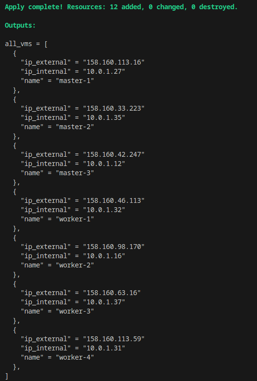
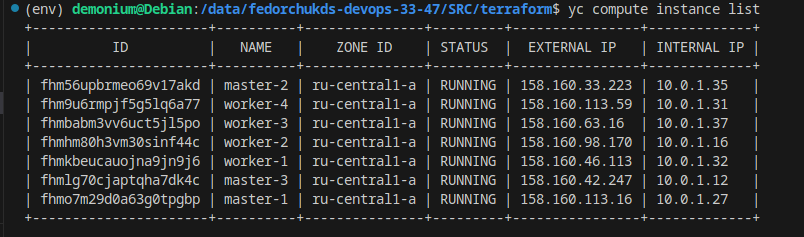
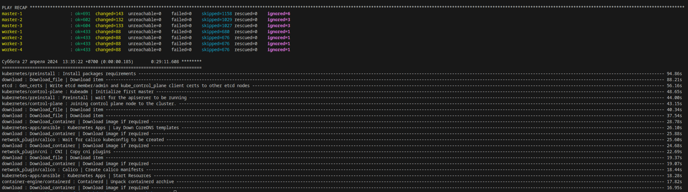
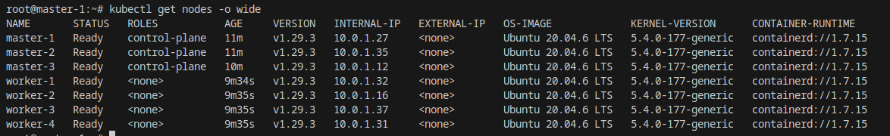
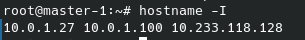
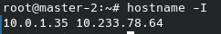
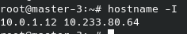
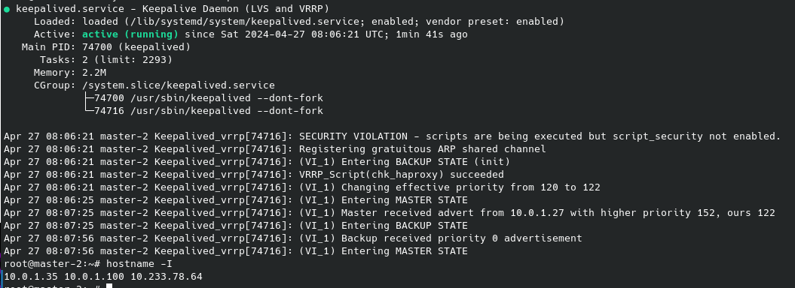
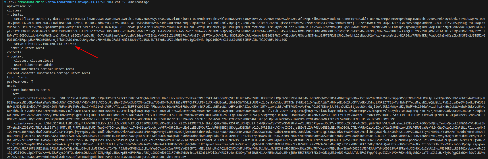
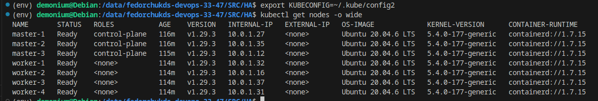

# Автор: Федорчук Дмитрий Сергеевич DEVOPS-33

# Домашнее задание к занятию «Установка Kubernetes»

### Задание 1. Установить кластер k8s с 1 master node

1. Подготовка работы кластера из 5 нод: 1 мастер и 4 рабочие ноды.
2. В качестве CRI — containerd.
3. Запуск etcd производить на мастере.
4. Способ установки выбрать самостоятельно.

### Задание 2*. Установить HA кластер

1. Установить кластер в режиме HA.
2. Использовать нечётное количество Master-node.
3. Для cluster ip использовать keepalived или другой способ.

### Выполнение задания:

Выполнять задачу я буду сразу со второго задания, так как оно включает в себя первое задание с некоторыми усложнениями.

С помощью Terraform разверну инфраструктуру - три Master ноды и четыре Worker ноды в Yandex.Cloud.

При разворачивании инфраструктуры на каждую ноду будут установлены дополнительные пакеты приложений, которые могут быть полезны в дальнейшем. Список пакетов указывается в файле `[cloud-init.yml](https://github.com/DemoniumBlack/fedorchukds-devops-33-47/blob/main/SRC/terraform/cloud-init.yml)`.
Также с помощью шаблонов, указанных в файле `[ansible.tf](https://github.com/DemoniumBlack/fedorchukds-devops-33-47/blob/main/SRC/terraform/ansible.tf)` автоматически формируются inventory файлы для дальнейшего разворачивания Kubernetes кластера в режиме High Availability.

Файлы шаблонов доступны по ссылкам:

https://github.com/DemoniumBlack/fedorchukds-devops-33-47/blob/main/SRC/terraform/hosts.tftpl

https://github.com/DemoniumBlack/fedorchukds-devops-33-47/blob/main/SRC/terraform/ha.tftpl

Запущу процесс разворачивания виртуальных машин с помощью Terraform. Буду использовать следующие команды:

`terraform init` - инициализирует рабочий каталог Terraform.

`terraform plan` - генерирует файл изменений и показывает, что изменится при запуске. Также может проверить конфигурацию Terraform и вывести ошибки при их наличии.

`terraform apply` - выполняет разворачивание инфраструктуры или изменяет ее случае изменения конфигурации Terraform.

В результате разворачивания инфраструктуры получаю следующие виртуальные машины:



Также посмотреть список виртуальных машин можно посмотреть с помощью команды `yc compute instance list`:



После завершения работы Terraform по указанному в `ansible.tf` пути автоматически сформировались inventory файлы, например:

```
all:
  hosts:
    master-1:
      ansible_host: 158.160.113.16
      ip: 10.0.1.27
      access_ip: 158.160.113.16
    master-2:
      ansible_host: 158.160.33.223
      ip: 10.0.1.35
      access_ip: 158.160.33.223
    master-3:
      ansible_host: 158.160.42.247
      ip: 10.0.1.12
      access_ip: 158.160.42.247
    worker-1:
      ansible_host: 158.160.46.113
      ip: 10.0.1.32
      access_ip: 158.160.46.113
    worker-2:
      ansible_host: 158.160.98.170
      ip: 10.0.1.16
      access_ip: 158.160.98.170
    worker-3:
      ansible_host: 158.160.63.16
      ip: 10.0.1.37
      access_ip: 158.160.63.16
    worker-4:
      ansible_host: 158.160.113.59
      ip: 10.0.1.31
      access_ip: 158.160.113.59
  children:
    kube_control_plane:
      hosts:
        master-1:
        master-2:
        master-3:
    kube_node:
      hosts:
        worker-1:
        worker-2:
        worker-3:
        worker-4:
    etcd:
      hosts:
        master-1:
        master-2:
        master-3:
    k8s_cluster:
      children:
        kube_control_plane:
        kube_node:
    calico_rr:
      hosts: {}
```

Следующим шагом командой ```ansible-playbook -i inventory/mycluster/hosts.yaml -u ubuntu --become --become-user=root --private-key=~/.ssh/id_ed25519 -e 'ansible_ssh_common_args="-o StrictHostKeyChecking=no"' cluster.yml --flush-cache``` запущу разворачивание Kubernetes кластера из репозитория Kubespray.

Разворачивание Kubernetes кластера занимает некоторое время и завершается успешно со следующим результатом:



Проверю, работает ли Kubernetes кластер:



Kubernetes кластер работает, все ноды в состоянии готовности.

Далее сделаю кластер высокодоступным. Для этого буду использовать настроенный Ansible Playbook, который установит на Master ноды Keepalived и HAproxy, создаст их конфигурационные файлы и автоматически установит нужные для работы параметры.

Командой ```ansible-playbook -i hosts.yaml -u ubuntu --become --become-user=root --private-key=~/.ssh/id_ed25519 -e 'ansible_ssh_common_args="-o StrictHostKeyChecking=no"' install-ha.yaml --flush-cache``` запускаю выполнение Playbook, который установит и настроит Keepalived и HAproxy.

Ссылка на Playbook: https://github.com/DemoniumBlack/fedorchukds-devops-33-47/blob/main/SRC/HA/install-ha.yaml

Проверю работу Keepalived. Одна Master нода относительно Keepalived имеет статус MASTER, две остальные Master ноды имеют статус BACKUP. На MASTER ноде находится еще один ip адрес, который принадлежит Keepalived:



На BACKUP нодах этого адреса нет:





Остановлю Keepalived на MASTER ноде и проверю адреса на BACKUP ноде:



Видно, что STATE сменился с BACKUP на MASTER и на ноде появился ip адрес 10.0.1.100, который указан в настройках Keepalived. Переключение адресов работает.

Теперь проверю работу балансировщика нагрузки HAproxy. Исходя из моих настроек, он будет отслеживать состояние трех Master нод Kubernetes кластера и будет принимать соединения на порт 7443.

Скопирую конфигурационный файл с одной из мастер нод на свою локальную машину и изменю в ней ip адрес на внешний адрес этой ноды и порт на 7443, который прослушивается HAproxy:



В качестве конфигурационного файла Kubernetes выберу новый файл и проверю доступность кластера с моей локальной машины:



Kubernetes Cluster отвечает, все ноды доступны, следовательно HAproxy работает. При необходимости Worker ноды можно подключать к Master нодам через HAproxy.